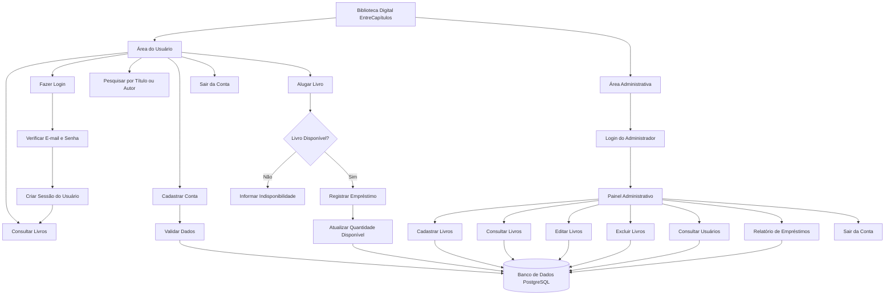

# Protótipo

```mermaid
graph TD
A[Biblioteca Digital EntreCapítulos] --> B[Área do Usuário]
A --> C[Área Administrativa]

B --> B1[Cadastrar Conta]
B --> B2[Fazer Login]
B --> B3[Consultar Livros]
B --> B4[Pesquisar por Título ou Autor]
B --> B6[Alugar Livro]
B --> B7[Sair da Conta]

B1 --> D[Validar Dados]
D --> E[(Banco de Dados PostgreSQL)]
B2 --> F[Verificar E-mail e Senha]
F --> G[Criar Sessão do Usuário]
G --> B3

B6 --> H{Livro Disponível?}
H -->|Sim| I[Registrar Empréstimo]
I --> J[Atualizar Quantidade Disponível]
J --> E
H -->|Não| K[Informar Indisponibilidade]

C --> C1[Login do Administrador]
C1 --> C2[Painel Administrativo]
C2 --> C3[Cadastrar Livros]
C2 --> C4[Consultar Livros]
C2 --> C5[Editar Livros]
C2 --> C6[Excluir Livros]
C2 --> C7[Consultar Usuários]
C2 --> C8[Relatório de Empréstimos]
C2 --> C9[Sair da Conta]

C3 --> E
C4 --> E
C5 --> E
C6 --> E
C7 --> E
C8 --> E
```